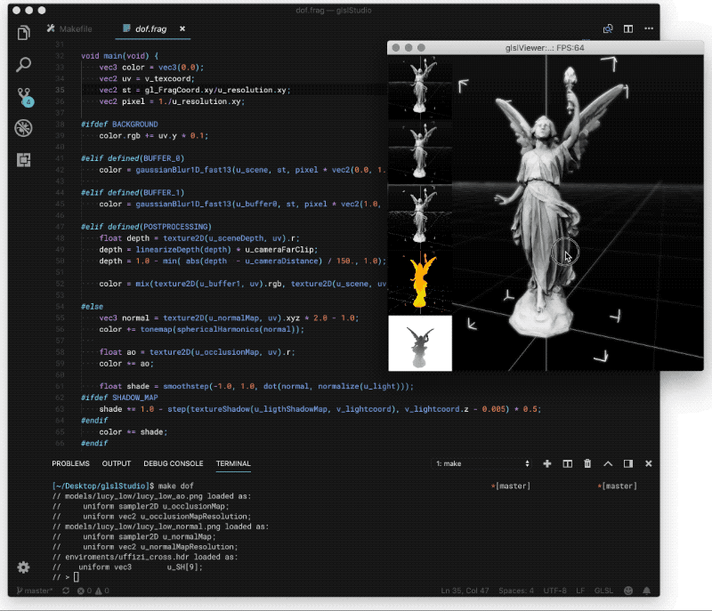
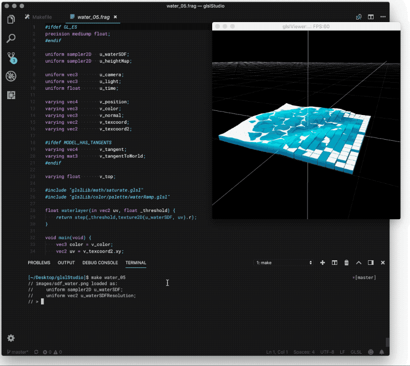

# glslViewer 

GlslViewer is a flexible console-base OpenGL Sandbox to display 2D/3D shaders with out the need of an UI. You can definitely make your own UI or wrapper using the Python module or any other tool that communicates back/forth with glslViewer thought the standard POSIX console In/Out.

GlslViewer support both 2D shaders and/or 3D shaders when a geometry (PLY/OBJ) is provided.

GlslViewer gives support to:

* fragment and vertex shaders on GLSL 120 (compatible with WebGL 1.0 and OpenGL ES 2.0)
* resolve `#include` dependencies
* adding/deleting `#defines`, plus a rich set of automatically generated set of defines.
* adding/deleting uniforms (float, int, vec2, vec3 and vec4)
* import of Textures
* import of Cubemaps and spherical harmonics
* import PLY/OBJ (with materials)
* hot reload of files on changes
* One default light and one default camera
* Interactive commands thought POSIX console IN/OUT

Wiki:

* [Installing GlslViewer](https://github.com/patriciogonzalezvivo/glslViewer/wiki/Installing-GlslViewer)

* [Using GlslViewer](https://github.com/patriciogonzalezvivo/glslViewer/wiki/Using-GlslViewer)

* [GlslViewer UNIFORMS and DEFINES conventions](https://github.com/patriciogonzalezvivo/glslViewer/wiki/GlslViewer-UNIFORMS-and-DEFINES-conventions)

## Author

[Patricio Gonzalez Vivo](https://twitter.com/patriciogv): [github](https://github.com/patriciogonzalezvivo) | [twitter](https://twitter.com/patriciogv) | [website](http://patricio.io)

## Acknowledgements

Thanks to:

* [Karim’s Naaki](http://karim.naaji.fr/) lot of concept and code was inspired by this two projects: [fragTool](https://github.com/karimnaaji/fragtool) and [hdreffects](https://github.com/karimnaaji/hdreffects)

* [Doug Moen](https://github.com/doug-moen) he help to add the compatibility to ShaderToy shaders and some RayMarching features were added for his integration with his project: [curv](https://github.com/doug-moen/curv).

* [Yvan Sraka](https://github.com/yvan-sraka) for putting the code in shape and setting it up for TravisCI.

* [Andsz](http://andsz.de/) for Spherical Harmonics code from [Spherical Harmonics Playground](https://github.com/ands/spherical_harmonics_playground/)

* [Syoyo Fujita](syoyo.wordpress.com) for the work on [tinyobjloader v1.0.x](https://github.com/syoyo/tinyobjloader)

* [Morgan McGuire](https://casual-effects.com)'s for the OBJ models on [Computer Graphics Archive](https://casual-effects.com/data)

* [Philip Rideout](http://prideout.net/) and [Romain Guy](http://www.curious-creature.com/) general generosity to share their code and experience
