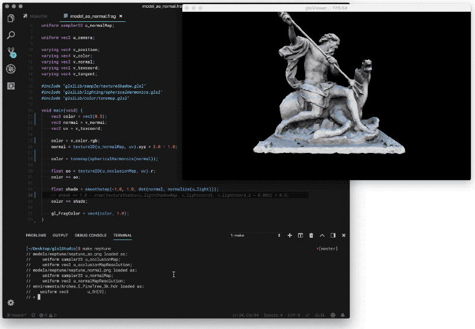

# glslViewer 

GlslViewer is a flexible console-base OpenGL Sandbox to display 2D/3D GLSL shaders without the need of an UI. You can definitely make your own UI or wrapper using the Python Module (include) or any other tool that communicates back/forth with glslViewer thought the standard POSIX console In/Out or OSC.

GlslViewer support both 2D shaders and/or 3D shaders when a geometry (LST, PLY, OBJ or GLTF) is provided.

GlslViewer gives support to:

* fragment and vertex shaders on GLSL 120
* resolve #include dependencies
* adding/deleting #define keys through console IN commands and OSC
* automatically generated set of defines based on the platform, buffer, render pass, geometry attributes and materials properties.
* passing custom uniforms (float, int, vec2, vec3 and vec4) through console IN or OSC
* import of Textures (png, bmp, jpg, tga, hdr and gif)
* import of Cubemaps and spherical harmonics (png, jpg, tga, hdr)
* import LST, PLY, OBJ or GLTF files (and their dependencies)
* default vert/frag shaders with PBR lighting model
* hot reload of files on changes
* One default light and one default camera
* Interactive commands thought POSIX console IN/OUT or OSC
* different debug modes (histogram, textures, buffers, bounding box, etc)
* shadow maps
* headless rendering
* fullscreen and screensaver mode
* image export
* PNG sequence export

## Wiki themes

* What is GlslViewer 
* [Compiling GlslViewer](https://github.com/patriciogonzalezvivo/glslViewer/wiki/Compiling-GlslViewer)
* [Using GlslViewer](https://github.com/patriciogonzalezvivo/glslViewer/wiki/Using-GlslViewer)
    * [Loading a single Fragment shader](https://github.com/patriciogonzalezvivo/glslViewer/wiki/Using-GlslViewer#1-loading-a-single-fragment-shader)
    * [Loading geometry and a vertex shader](https://github.com/patriciogonzalezvivo/glslViewer/wiki/Using-GlslViewer#2-loading-geometry-and-a-vertex-shader)
    * [Load a model and edit the default PBR shader](https://github.com/patriciogonzalezvivo/glslViewer/wiki/Using-GlslViewer#21-load-a-model-and-edit-the-default-pbr-shader) 
    * [Loading Textures](https://github.com/patriciogonzalezvivo/glslViewer/wiki/Using-GlslViewer#3-loading-textures)
    * [Other arguments](https://github.com/patriciogonzalezvivo/glslViewer/wiki/Using-GlslViewer#4-other-arguments)
    * [Console IN commands](https://github.com/patriciogonzalezvivo/glslViewer/wiki/Using-GlslViewer#console-in-commands)

* **Convensions**: over all GlslViewer is designed to be flexible, that means that sticks very close to GLSL language. There is not extra languages or meta data on top. The only conventions comes on the native uniform names and defines GlslViewer use to send information like time, resolution, lights, vertex attributes, material properties, platform type, shadowmap name, etc. 
    * [Defines](https://github.com/patriciogonzalezvivo/glslViewer/wiki/GlslViewer-DEFINES)
    * [Uniforms](https://github.com/patriciogonzalezvivo/glslViewer/wiki/GlslViewer-UNIFORMS)
    * [Multiple buffers, background and postprocessing render pass](https://github.com/patriciogonzalezvivo/glslViewer/wiki/Multiple-render-passes-and-Buffers)
* [Python wrapper](https://github.com/patriciogonzalezvivo/glslViewer/wiki/Python-wrapper-for-GlslViewer)

## Bugs to fix

[ ] [Support for GL (Full KMS) or GL (Fake KMS) on RaspberryPi](https://github.com/patriciogonzalezvivo/glslViewer/issues/135)

[ ] Depth frag shader for scene depthmap  ( `u_sceneDepth` ) instead of rendering to multiple targets ( only on RPI )

[ ] Depth frag shader for light's shadowMap, to work on RPI

## Author

[Patricio Gonzalez Vivo](https://twitter.com/patriciogv): [github](https://github.com/patriciogonzalezvivo) | [twitter](https://twitter.com/patriciogv) | [instagram](https://www.instagram.com/patriciogonzalezvivo/) | [website](http://patricio.io)

## Acknowledgements

Thanks to:

* [Mihai Sebea](https://twitter.com/mihai_sebea) for making the Windows compile happen

* [Karim Naaki](http://karim.naaji.fr/) lot of concept and code was inspired by this two projects: [fragTool](https://github.com/karimnaaji/fragtool) and [hdreffects](https://github.com/karimnaaji/hdreffects)

* [Doug Moen](https://github.com/doug-moen) he help to add the compatibility to ShaderToy shaders and some RayMarching features were added for his integration with his project: [curv](https://github.com/doug-moen/curv).

* [Wray](https://twitter.com/wraybowling) implement the OSC listener feature, opening GlslViewer to an entire new ways of communicating and interacting with other apps, devices and ecosystems.

* [Yvan Sraka](https://github.com/yvan-sraka) for putting the code in shape and setting it up for TravisCI.

* [Andsz](http://andsz.de/) for Spherical Harmonics code from [Spherical Harmonics Playground](https://github.com/ands/spherical_harmonics_playground/)

* [Syoyo Fujita](syoyo.wordpress.com) for the work on [tinyobjloader v1.0.x](https://github.com/syoyo/tinyobjloader)

* [Morgan McGuire](https://casual-effects.com)'s for the OBJ models on [Computer Graphics Archive](https://casual-effects.com/data)

* [Philip Rideout](http://prideout.net/) and [Romain Guy](http://www.curious-creature.com/) general generosity to share their code and experience

* [Mihai Sebea](https://codepatcher.wordpress.com) for porting it to windows(TM) 

